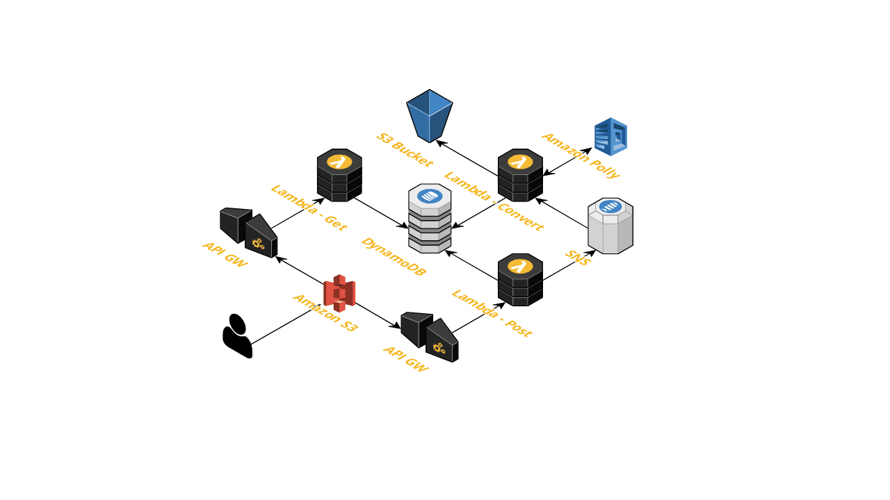

# sam-app



## Requirements

* AWS CLI already configured with Administrator permission
* [NodeJS 10.10+ installed](https://nodejs.org/en/download/releases/)
* [Docker installed](https://www.docker.com/community-edition)


**Invoking function locally using a local sample payload**
```
npm local-invoke
```
 
**Invoking function locally through local API Gateway**

```
npm local-start-api
```

## Packaging and deployment

```
npm build
npm package
npm deploy

or

npm bpd
```

## Fetch, tail, and filter Lambda function logs

```bash
sam logs -n HelloWorldFunction --stack-name tts-microservice --tail
```
## Testing

```
npm test
```

## Cleanup

```bash
aws cloudformation delete-stack --stack-name tts-microservice
```