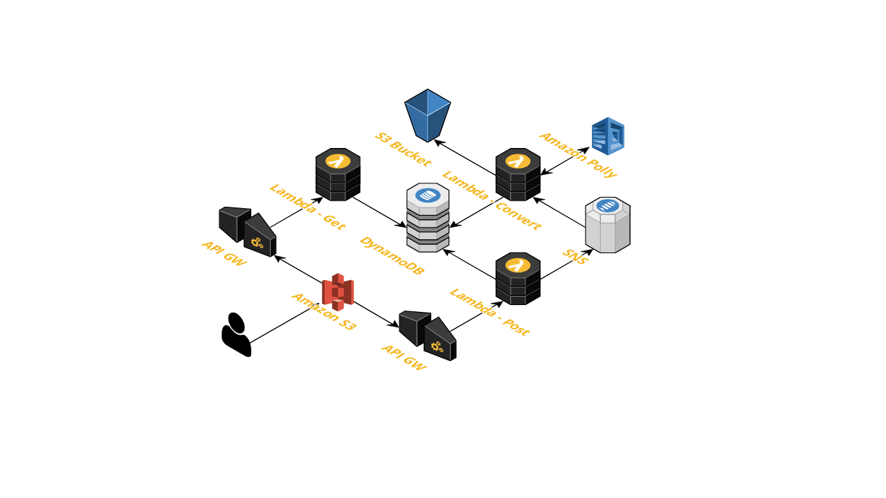

# Stack



## Requirements

* AWS CLI already configured with Administrator permission
* NodeJS 8+ installed
* Docker installed

**Invoking function locally using a local sample payload**
```
npm local-invoke
```
 
**Invoking function locally through local API Gateway**

```
npm local-api
```

## Packaging and deployment

```
npm run build
npm run package
npm run deploy

or

npm run bpd
```

## Testing

```
npm test
```

## Cleanup

```bash
aws cloudformation delete-stack --stack-name tts-microservice
```